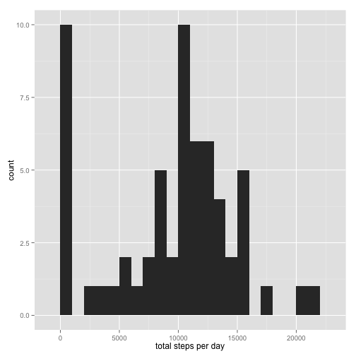
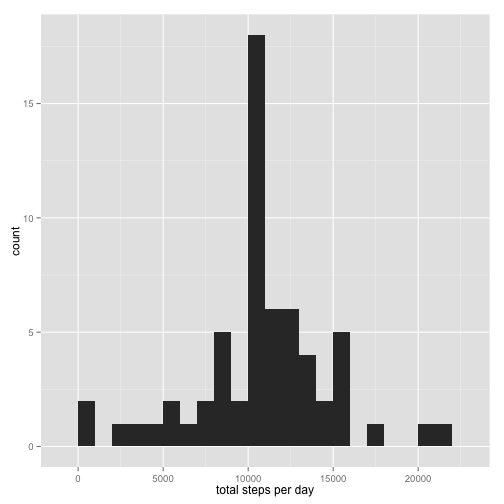

## Loading and preprocessing the data


We load all required libraries and set options for all R code chunks. 


```r
library(ggplot2)
library(xtable)
library(knitr)
opts_chunk$set(results="asis")
```


We unzip the file containing the activity monitoring data and read the CSV into R.


```r
unzip('activity.zip')
activityData <- read.csv('activity.csv')
print(xtable(head(activityData)), type="html")
```

<!-- html table generated in R 3.2.1 by xtable 1.7-4 package -->
<!-- Sun Jul 19 12:10:59 2015 -->
<table border=1>
<tr> <th>  </th> <th> steps </th> <th> date </th> <th> interval </th>  </tr>
  <tr> <td align="right"> 1 </td> <td align="right">  </td> <td> 2012-10-01 </td> <td align="right">   0 </td> </tr>
  <tr> <td align="right"> 2 </td> <td align="right">  </td> <td> 2012-10-01 </td> <td align="right">   5 </td> </tr>
  <tr> <td align="right"> 3 </td> <td align="right">  </td> <td> 2012-10-01 </td> <td align="right">  10 </td> </tr>
  <tr> <td align="right"> 4 </td> <td align="right">  </td> <td> 2012-10-01 </td> <td align="right">  15 </td> </tr>
  <tr> <td align="right"> 5 </td> <td align="right">  </td> <td> 2012-10-01 </td> <td align="right">  20 </td> </tr>
  <tr> <td align="right"> 6 </td> <td align="right">  </td> <td> 2012-10-01 </td> <td align="right">  25 </td> </tr>
   </table>


## What is mean total number of steps taken per day?


We calculate the total number of steps taken per day.


```r
stepsPerDay <- tapply(activityData$steps, 
                      activityData$date, 
                      sum, na.rm=T)
print(xtable(as.data.frame(stepsPerDay)), type="html")
```

<!-- html table generated in R 3.2.1 by xtable 1.7-4 package -->
<!-- Sun Jul 19 12:10:59 2015 -->
<table border=1>
<tr> <th>  </th> <th> stepsPerDay </th>  </tr>
  <tr> <td align="right"> 2012-10-01 </td> <td align="right">   0 </td> </tr>
  <tr> <td align="right"> 2012-10-02 </td> <td align="right"> 126 </td> </tr>
  <tr> <td align="right"> 2012-10-03 </td> <td align="right"> 11352 </td> </tr>
  <tr> <td align="right"> 2012-10-04 </td> <td align="right"> 12116 </td> </tr>
  <tr> <td align="right"> 2012-10-05 </td> <td align="right"> 13294 </td> </tr>
  <tr> <td align="right"> 2012-10-06 </td> <td align="right"> 15420 </td> </tr>
  <tr> <td align="right"> 2012-10-07 </td> <td align="right"> 11015 </td> </tr>
  <tr> <td align="right"> 2012-10-08 </td> <td align="right">   0 </td> </tr>
  <tr> <td align="right"> 2012-10-09 </td> <td align="right"> 12811 </td> </tr>
  <tr> <td align="right"> 2012-10-10 </td> <td align="right"> 9900 </td> </tr>
  <tr> <td align="right"> 2012-10-11 </td> <td align="right"> 10304 </td> </tr>
  <tr> <td align="right"> 2012-10-12 </td> <td align="right"> 17382 </td> </tr>
  <tr> <td align="right"> 2012-10-13 </td> <td align="right"> 12426 </td> </tr>
  <tr> <td align="right"> 2012-10-14 </td> <td align="right"> 15098 </td> </tr>
  <tr> <td align="right"> 2012-10-15 </td> <td align="right"> 10139 </td> </tr>
  <tr> <td align="right"> 2012-10-16 </td> <td align="right"> 15084 </td> </tr>
  <tr> <td align="right"> 2012-10-17 </td> <td align="right"> 13452 </td> </tr>
  <tr> <td align="right"> 2012-10-18 </td> <td align="right"> 10056 </td> </tr>
  <tr> <td align="right"> 2012-10-19 </td> <td align="right"> 11829 </td> </tr>
  <tr> <td align="right"> 2012-10-20 </td> <td align="right"> 10395 </td> </tr>
  <tr> <td align="right"> 2012-10-21 </td> <td align="right"> 8821 </td> </tr>
  <tr> <td align="right"> 2012-10-22 </td> <td align="right"> 13460 </td> </tr>
  <tr> <td align="right"> 2012-10-23 </td> <td align="right"> 8918 </td> </tr>
  <tr> <td align="right"> 2012-10-24 </td> <td align="right"> 8355 </td> </tr>
  <tr> <td align="right"> 2012-10-25 </td> <td align="right"> 2492 </td> </tr>
  <tr> <td align="right"> 2012-10-26 </td> <td align="right"> 6778 </td> </tr>
  <tr> <td align="right"> 2012-10-27 </td> <td align="right"> 10119 </td> </tr>
  <tr> <td align="right"> 2012-10-28 </td> <td align="right"> 11458 </td> </tr>
  <tr> <td align="right"> 2012-10-29 </td> <td align="right"> 5018 </td> </tr>
  <tr> <td align="right"> 2012-10-30 </td> <td align="right"> 9819 </td> </tr>
  <tr> <td align="right"> 2012-10-31 </td> <td align="right"> 15414 </td> </tr>
  <tr> <td align="right"> 2012-11-01 </td> <td align="right">   0 </td> </tr>
  <tr> <td align="right"> 2012-11-02 </td> <td align="right"> 10600 </td> </tr>
  <tr> <td align="right"> 2012-11-03 </td> <td align="right"> 10571 </td> </tr>
  <tr> <td align="right"> 2012-11-04 </td> <td align="right">   0 </td> </tr>
  <tr> <td align="right"> 2012-11-05 </td> <td align="right"> 10439 </td> </tr>
  <tr> <td align="right"> 2012-11-06 </td> <td align="right"> 8334 </td> </tr>
  <tr> <td align="right"> 2012-11-07 </td> <td align="right"> 12883 </td> </tr>
  <tr> <td align="right"> 2012-11-08 </td> <td align="right"> 3219 </td> </tr>
  <tr> <td align="right"> 2012-11-09 </td> <td align="right">   0 </td> </tr>
  <tr> <td align="right"> 2012-11-10 </td> <td align="right">   0 </td> </tr>
  <tr> <td align="right"> 2012-11-11 </td> <td align="right"> 12608 </td> </tr>
  <tr> <td align="right"> 2012-11-12 </td> <td align="right"> 10765 </td> </tr>
  <tr> <td align="right"> 2012-11-13 </td> <td align="right"> 7336 </td> </tr>
  <tr> <td align="right"> 2012-11-14 </td> <td align="right">   0 </td> </tr>
  <tr> <td align="right"> 2012-11-15 </td> <td align="right">  41 </td> </tr>
  <tr> <td align="right"> 2012-11-16 </td> <td align="right"> 5441 </td> </tr>
  <tr> <td align="right"> 2012-11-17 </td> <td align="right"> 14339 </td> </tr>
  <tr> <td align="right"> 2012-11-18 </td> <td align="right"> 15110 </td> </tr>
  <tr> <td align="right"> 2012-11-19 </td> <td align="right"> 8841 </td> </tr>
  <tr> <td align="right"> 2012-11-20 </td> <td align="right"> 4472 </td> </tr>
  <tr> <td align="right"> 2012-11-21 </td> <td align="right"> 12787 </td> </tr>
  <tr> <td align="right"> 2012-11-22 </td> <td align="right"> 20427 </td> </tr>
  <tr> <td align="right"> 2012-11-23 </td> <td align="right"> 21194 </td> </tr>
  <tr> <td align="right"> 2012-11-24 </td> <td align="right"> 14478 </td> </tr>
  <tr> <td align="right"> 2012-11-25 </td> <td align="right"> 11834 </td> </tr>
  <tr> <td align="right"> 2012-11-26 </td> <td align="right"> 11162 </td> </tr>
  <tr> <td align="right"> 2012-11-27 </td> <td align="right"> 13646 </td> </tr>
  <tr> <td align="right"> 2012-11-28 </td> <td align="right"> 10183 </td> </tr>
  <tr> <td align="right"> 2012-11-29 </td> <td align="right"> 7047 </td> </tr>
  <tr> <td align="right"> 2012-11-30 </td> <td align="right">   0 </td> </tr>
   </table>


We plot a histogram of total daily steps for all days for which activity was monitored.


```r
dailySteps <- ggplot(as.data.frame(stepsPerDay), 
                     aes(x=stepsPerDay)) + 
  geom_histogram(binwidth=1000) + 
  xlab('total steps per day')
dailySteps
```

 


We report the mean and median total daily steps.


```r
mean(stepsPerDay)
```

[1] 9354.23

```r
median(stepsPerDay)
```

[1] 10395


## What is the average daily activity pattern?


We plot the time series of the mean number of steps taken per five-minute interval, averaged across all days for which activity was monitored.


```r
averageIntervalSteps <- tapply(activityData$steps, 
                               activityData$interval, 
                               mean, na.rm=T)
intervalSteps <- ggplot(as.data.frame(averageIntervalSteps), 
                        aes(x=as.numeric(names(averageIntervalSteps)),
                            y=averageIntervalSteps)) + 
  geom_line() +
  xlab('five-minute interval') +
  ylab('average number of steps')
intervalSteps
```

 


We report the time interval for which the maximum mean steps were taken.


```r
names(averageIntervalSteps)[which(averageIntervalSteps == max(averageIntervalSteps))]
```

[1] "835"


## Imputing missing values


We calculate the number of missing values in the data set.


```r
sum(is.na(activityData$steps))
```

[1] 2304


We impute missing values by filling in the mean steps for the given five-minute interval. We check to see that there are no longer any missing values in the resulting vector of values.


```r
imputedSteps <- sapply(1:nrow(activityData), function(x){
  if(is.na(activityData[x,'steps'])){
    interval <- as.character(activityData[x,'interval'])
    return(averageIntervalSteps[interval])
  } else {
    return(activityData[x,'steps'])
  }
})
sum(is.na(imputedSteps))
```

[1] 0


We create a new data set with the imputed values.


```r
imputedData <- data.frame(imputedSteps = imputedSteps,
                          date = activityData$date,
                          interval = activityData$interval)
print(xtable(head(imputedData)), type="html")
```

<!-- html table generated in R 3.2.1 by xtable 1.7-4 package -->
<!-- Sun Jul 19 12:11:00 2015 -->
<table border=1>
<tr> <th>  </th> <th> imputedSteps </th> <th> date </th> <th> interval </th>  </tr>
  <tr> <td align="right"> 1 </td> <td align="right"> 1.72 </td> <td> 2012-10-01 </td> <td align="right">   0 </td> </tr>
  <tr> <td align="right"> 2 </td> <td align="right"> 0.34 </td> <td> 2012-10-01 </td> <td align="right">   5 </td> </tr>
  <tr> <td align="right"> 3 </td> <td align="right"> 0.13 </td> <td> 2012-10-01 </td> <td align="right">  10 </td> </tr>
  <tr> <td align="right"> 4 </td> <td align="right"> 0.15 </td> <td> 2012-10-01 </td> <td align="right">  15 </td> </tr>
  <tr> <td align="right"> 5 </td> <td align="right"> 0.08 </td> <td> 2012-10-01 </td> <td align="right">  20 </td> </tr>
  <tr> <td align="right"> 6 </td> <td align="right"> 2.09 </td> <td> 2012-10-01 </td> <td align="right">  25 </td> </tr>
   </table>


We plot a histogram of the total daily steps, using the imputed data set.


```r
imputedStepsPerDay <- tapply(imputedData$imputedSteps, 
                      imputedData$date, 
                      sum, na.rm=T)
imputedDailySteps <- ggplot(as.data.frame(imputedStepsPerDay), 
                            aes(x=imputedStepsPerDay)) + 
  geom_histogram(binwidth=1000) + 
  xlab('total steps per day')
imputedDailySteps
```

 


We report the mean and median total daily steps, using the imputed data set.


```r
mean(imputedStepsPerDay)
```

[1] 10766.19

```r
median(imputedStepsPerDay)
```

[1] 10766.19


Adding imputed values leads to a higher estimate of the mean and median. This impact on these summary statistics makes sense given that the missing values were not added to the total when using the original data set.


## Are there differences in activity patterns between weekdays and weekends?


For each day that activity was monitored, we determine whether the date was a weekday or during the weekend.


```r
weekday <- sapply(imputedData$date, function(x){
  if(weekdays(as.Date(x)) == 'Sunday' | weekdays(as.Date(x)) == 'Saturday'){
    return('weekend')
  } else {
    return('weekday')
  }
})
```


We add this variable to the data set, and plot time series of mean number of steps taken per five-minute interval, separated by whether the day was a weekday or during the weekend.


```r
imputedData <- data.frame(imputedData,
                          weekday = weekday)
weekdayVsEnd <- ggplot(data=imputedData,
                       aes(x=interval, 
                           y=imputedSteps)) +
  geom_line(stat="summary", fun.y="mean") +
  facet_grid(weekday ~ .) +
  xlab('five-minute interval') +
  ylab('average number of steps (imputed data)')
weekdayVsEnd
```

 

